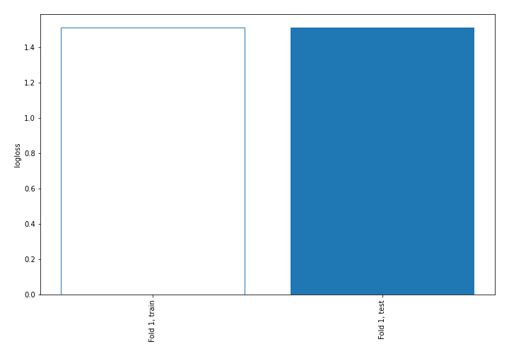
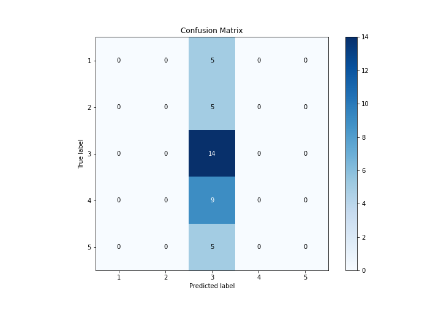
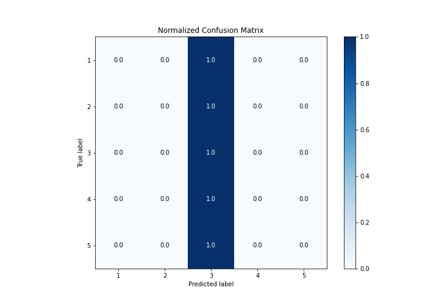
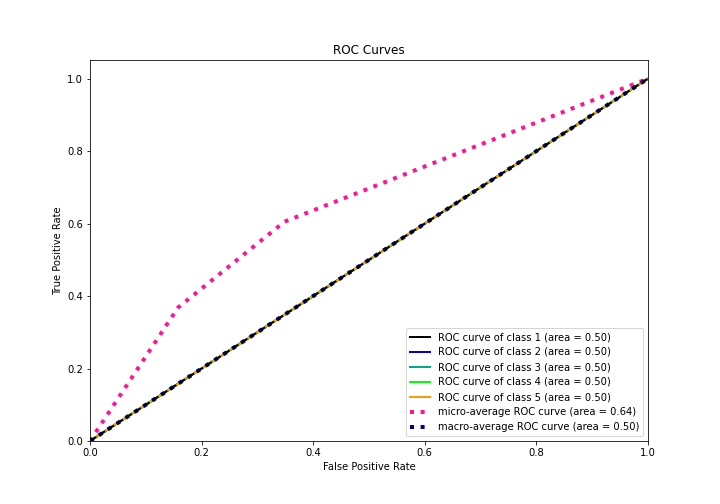
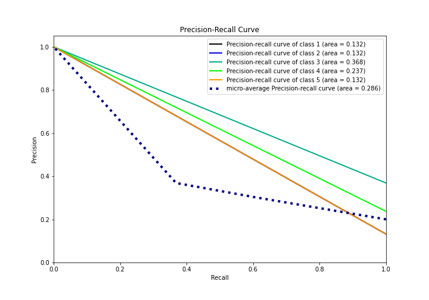

# Summary of 1_Baseline

[<< Go back](../README.md)

## Baseline Classifier (Baseline)
- **n_jobs**: -1
- **num_class**: 5
- **explain_level**: 2

## Validation
 - **validation_type**: split
 - **train_ratio**: 0.75
 - **shuffle**: True
 - **stratify**: True

## Optimized metric
logloss

## Training time

0.4 seconds

### Metric details
|           |   1 |   2 |         3 |   4 |   5 |   accuracy |   macro avg |   weighted avg |   logloss |
|:----------|----:|----:|----------:|----:|----:|-----------:|------------:|---------------:|----------:|
| precision |   0 |   0 |  0.368421 |   0 |   0 |   0.368421 |   0.0736842 |       0.135734 |   1.51083 |
| recall    |   0 |   0 |  1        |   0 |   0 |   0.368421 |   0.2       |       0.368421 |   1.51083 |
| f1-score  |   0 |   0 |  0.538462 |   0 |   0 |   0.368421 |   0.107692  |       0.198381 |   1.51083 |
| support   |   5 |   5 | 14        |   9 |   5 |   0.368421 |  38         |      38        |   1.51083 |

## Confusion matrix
|              |   Predicted as 1 |   Predicted as 2 |   Predicted as 3 |   Predicted as 4 |   Predicted as 5 |
|:-------------|-----------------:|-----------------:|-----------------:|-----------------:|-----------------:|
| Labeled as 1 |                0 |                0 |                5 |                0 |                0 |
| Labeled as 2 |                0 |                0 |                5 |                0 |                0 |
| Labeled as 3 |                0 |                0 |               14 |                0 |                0 |
| Labeled as 4 |                0 |                0 |                9 |                0 |                0 |
| Labeled as 5 |                0 |                0 |                5 |                0 |                0 |

## Learning curves

## Confusion Matrix

## Normalized Confusion Matrix

## ROC Curve

## Precision Recall Curve

[<< Go back](../README.md)
