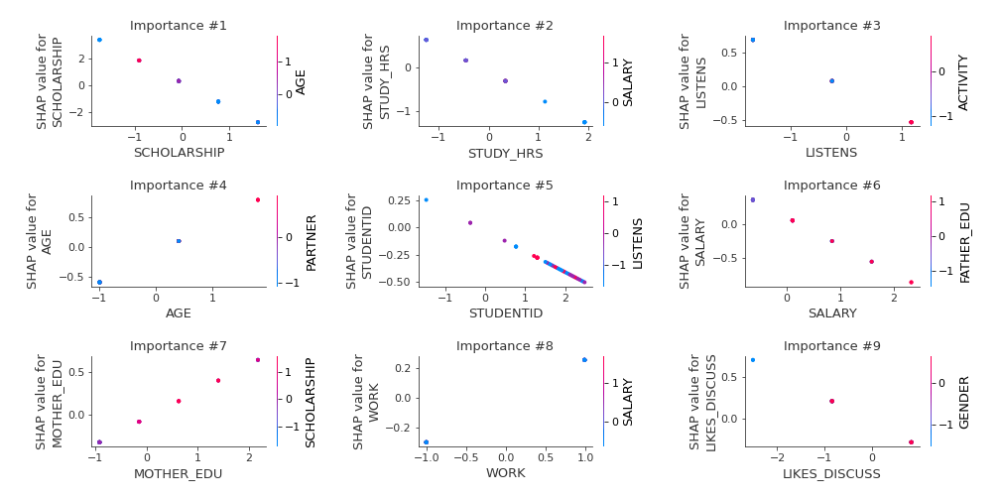

# Summary of 3_Linear

[<< Go back](../README.md)

## Logistic Regression (Linear)
- **n_jobs**: -1
- **num_class**: 5
- **explain_level**: 2

## Validation
 - **validation_type**: split
 - **train_ratio**: 0.75
 - **shuffle**: True
 - **stratify**: True

## Optimized metric
logloss

## Training time

11.9 seconds

### Metric details
|           |   1 |        2 |         3 |        4 |        5 |   accuracy |   macro avg |   weighted avg |   logloss |
|:----------|----:|---------:|----------:|---------:|---------:|-----------:|------------:|---------------:|----------:|
| precision |   1 | 0.833333 |  0.75     | 0.454545 | 1        |   0.736842 |    0.807576 |       0.756778 |  0.639863 |
| recall    |   1 | 1        |  0.642857 | 0.555556 | 0.8      |   0.736842 |    0.799683 |       0.736842 |  0.639863 |
| f1-score  |   1 | 0.909091 |  0.692308 | 0.5      | 0.888889 |   0.736842 |    0.798057 |       0.741637 |  0.639863 |
| support   |   5 | 5        | 14        | 9        | 5        |   0.736842 |   38        |      38        |  0.639863 |

## Confusion matrix
|              |   Predicted as 1 |   Predicted as 2 |   Predicted as 3 |   Predicted as 4 |   Predicted as 5 |
|:-------------|-----------------:|-----------------:|-----------------:|-----------------:|-----------------:|
| Labeled as 1 |                5 |                0 |                0 |                0 |                0 |
| Labeled as 2 |                0 |                5 |                0 |                0 |                0 |
| Labeled as 3 |                0 |                0 |                9 |                5 |                0 |
| Labeled as 4 |                0 |                1 |                3 |                5 |                0 |
| Labeled as 5 |                0 |                0 |                0 |                1 |                4 |

## Learning curves

## Coefficients

### Coefficients learner #1
|               |           1 |          2 |           3 |            4 |          5 |
|:--------------|------------:|-----------:|------------:|-------------:|-----------:|
| intercept     | -1.20421    | -1.55712   |  2.87503    |  0.92897     | -1.04267   |
| STUDENTID     |  0.398786   | -0.0646274 | -0.190081   |  0.176642    | -0.32072   |
| AGE           | -0.281329   |  0.581062  |  0.498778   | -0.650035    | -0.148476  |
| GENDER        |  0.238488   |  0.402073  |  0.101322   | -0.861914    |  0.12003   |
| HS_TYPE       |  0.0358368  | -0.490806  |  0.155327   | -0.0625875   |  0.36223   |
| SCHOLARSHIP   | -0.73027    | -0.648267  | -1.84268    |  0.801479    |  2.41973   |
| WORK          | -0.416096   | -0.120448  |  0.281302   | -0.0157999   |  0.271042  |
| ACTIVITY      |  0.248782   | -0.685568  | -0.0334262  |  0.744208    | -0.273995  |
| PARTNER       | -0.419116   |  0.353271  | -0.108164   |  0.219153    | -0.0451434 |
| SALARY        | -0.118185   |  0.820495  | -0.415459   |  0.332075    | -0.618926  |
| TRANSPORT     | -0.0902524  | -0.182454  | -0.00417353 |  0.174127    |  0.102753  |
| LIVING        |  0.214545   | -0.484884  |  0.223038   |  0.21737     | -0.170069  |
| MOTHER_EDU    | -0.362659   |  0.239418  |  0.311587   | -0.154318    | -0.0340274 |
| FATHER_EDU    | -0.233202   |  0.460995  | -0.117777   |  0.131455    | -0.241471  |
| #_SIBLINGS    |  0.227124   | -0.121996  | -0.0397894  |  0.159054    | -0.224393  |
| KIDS          | -0.0538112  | -0.257439  |  0.103401   |  0.00607263  |  0.201777  |
| MOTHER_JOB    | -0.185222   |  0.360666  | -0.272958   |  0.696228    | -0.598714  |
| FATHER_JOB    |  0.0332367  | -0.340939  |  0.245026   |  0.278832    | -0.216156  |
| STUDY_HRS     |  0.756108   |  0.0471678 | -0.583369   | -0.0202517   | -0.199655  |
| READ_FREQ     | -0.00288781 |  0.362119  | -0.253286   | -0.154567    |  0.0486219 |
| READ_FREQ_SCI | -0.641409   |  0.357432  |  0.00747372 |  0.393873    | -0.117369  |
| ATTEND_DEPT   | -0.156381   | -0.130549  |  0.242231   | -0.372074    |  0.416772  |
| IMPACT        | -0.0624625  | -0.0409539 |  0.226699   |  0.000756287 | -0.124039  |
| ATTEND        | -0.146986   |  0.235401  |  0.00948294 | -0.0204165   | -0.0774815 |
| PREP_STUDY    | -0.151048   |  0.521113  | -0.184238   | -0.378323    |  0.192496  |
| PREP_EXAM     | -0.111096   |  0.258052  |  0.286641   | -0.259528    | -0.174069  |
| NOTES         |  0.134263   | -0.114689  | -0.132528   |  0.00638212  |  0.106573  |
| LISTENS       |  0.403273   | -0.421387  | -0.430334   |  0.258827    |  0.18962   |
| LIKES_DISCUSS |  0.268785   |  0.0667323 | -0.292706   | -0.180711    |  0.1379    |
| CLASSROOM     | -0.100852   |  0.47535   |  0.0858782  | -0.687416    |  0.22704   |
| CUML_GPA      | -0.32037    | -0.355591  | -0.00300306 |  0.439217    |  0.239748  |
| EXP_GPA       | -0.270307   | -0.139721  | -0.313046   |  0.529741    |  0.193334  |
| COURSE ID     |  0.131936   | -0.219326  | -0.135293   |  0.044917    |  0.177766  |

## Permutation-based Importance

## Confusion Matrix

## Normalized Confusion Matrix

## ROC Curve

## Precision Recall Curve

## SHAP Importance

## SHAP Dependence plots

### Dependence 1 (Fold 1)

### Dependence 2 (Fold 1)

### Dependence 3 (Fold 1)

### Dependence 4 (Fold 1)

### Dependence 5 (Fold 1)

## SHAP Decision plots

### Worst decisions for selected sample 1 (Fold 1)

### Worst decisions for selected sample 2 (Fold 1)

### Worst decisions for selected sample 3 (Fold 1)

### Worst decisions for selected sample 4 (Fold 1)

### Best decisions for selected sample 1 (Fold 1)

### Best decisions for selected sample 2 (Fold 1)

### Best decisions for selected sample 3 (Fold 1)

### Best decisions for selected sample 4 (Fold 1)

[<< Go back](../README.md)
