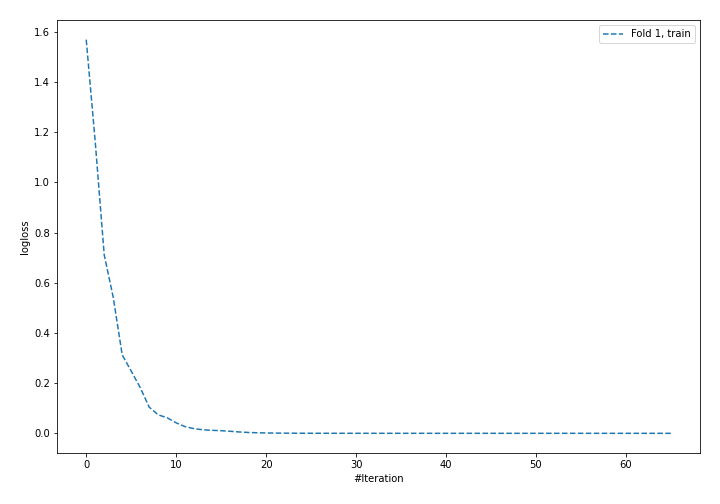
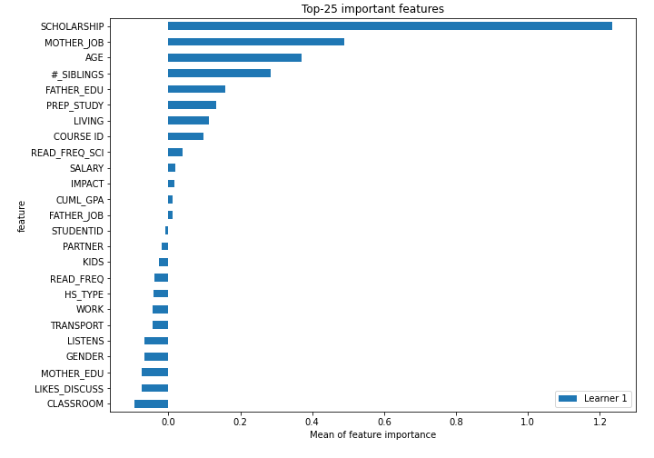
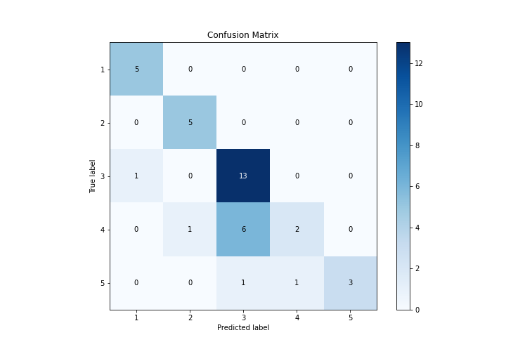
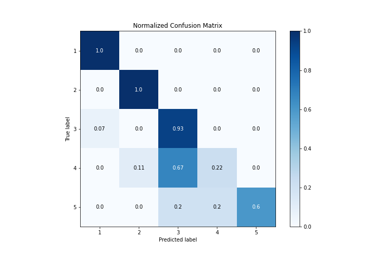
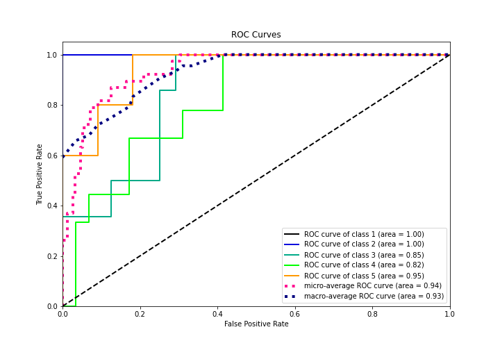
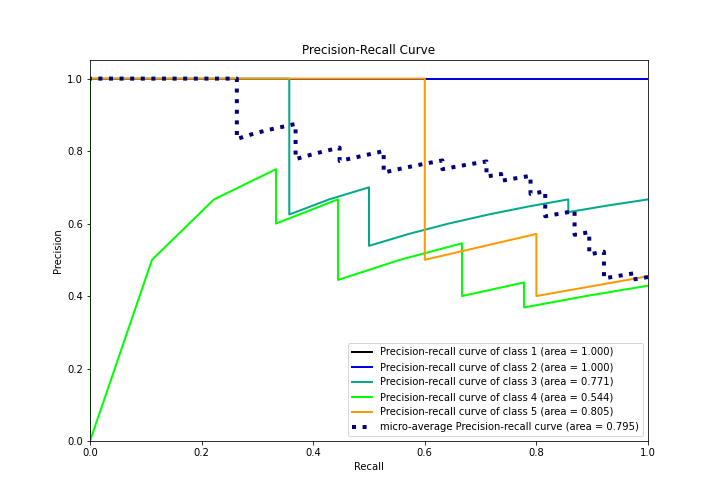

# Summary of 5_Default_NeuralNetwork

[<< Go back](../README.md)

## Neural Network
- **n_jobs**: -1
- **dense_1_size**: 32
- **dense_2_size**: 16
- **learning_rate**: 0.05
- **num_class**: 5
- **explain_level**: 2

## Validation
 - **validation_type**: split
 - **train_ratio**: 0.75
 - **shuffle**: True
 - **stratify**: True

## Optimized metric
logloss

## Training time

1.8 seconds

### Metric details
|           |        1 |        2 |         3 |        4 |    5 |   accuracy |   macro avg |   weighted avg |   logloss |
|:----------|---------:|---------:|----------:|---------:|-----:|-----------:|------------:|---------------:|----------:|
| precision | 0.833333 | 0.833333 |  0.65     | 0.666667 | 1    |   0.736842 |    0.796667 |       0.748246 |   1.38948 |
| recall    | 1        | 1        |  0.928571 | 0.222222 | 0.6  |   0.736842 |    0.750159 |       0.736842 |   1.38948 |
| f1-score  | 0.909091 | 0.909091 |  0.764706 | 0.333333 | 0.75 |   0.736842 |    0.733244 |       0.6986   |   1.38948 |
| support   | 5        | 5        | 14        | 9        | 5    |   0.736842 |   38        |      38        |   1.38948 |

## Confusion matrix
|              |   Predicted as 1 |   Predicted as 2 |   Predicted as 3 |   Predicted as 4 |   Predicted as 5 |
|:-------------|-----------------:|-----------------:|-----------------:|-----------------:|-----------------:|
| Labeled as 1 |                5 |                0 |                0 |                0 |                0 |
| Labeled as 2 |                0 |                5 |                0 |                0 |                0 |
| Labeled as 3 |                1 |                0 |               13 |                0 |                0 |
| Labeled as 4 |                0 |                1 |                6 |                2 |                0 |
| Labeled as 5 |                0 |                0 |                1 |                1 |                3 |

## Learning curves

## Permutation-based Importance

## Confusion Matrix

## Normalized Confusion Matrix

## ROC Curve

## Precision Recall Curve

[<< Go back](../README.md)
