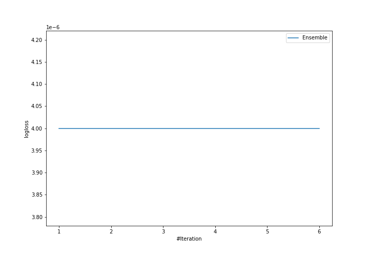
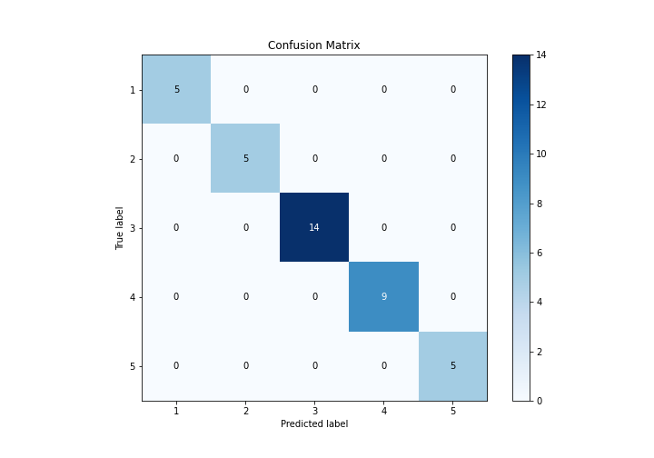
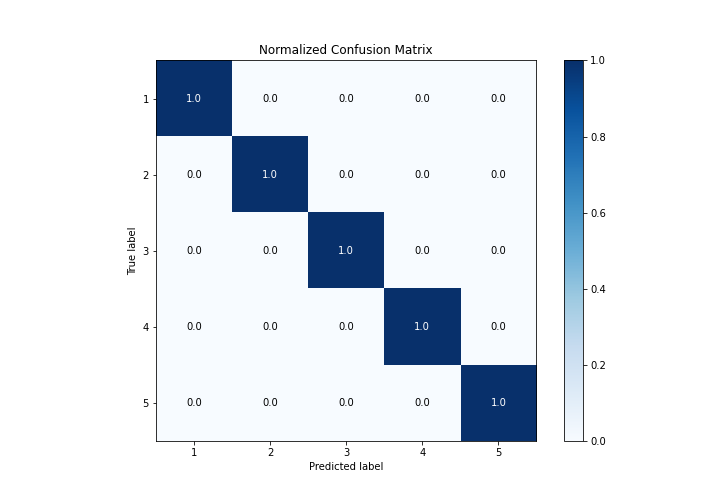
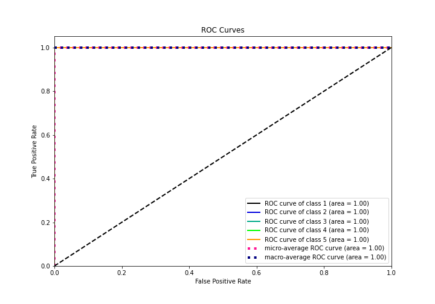
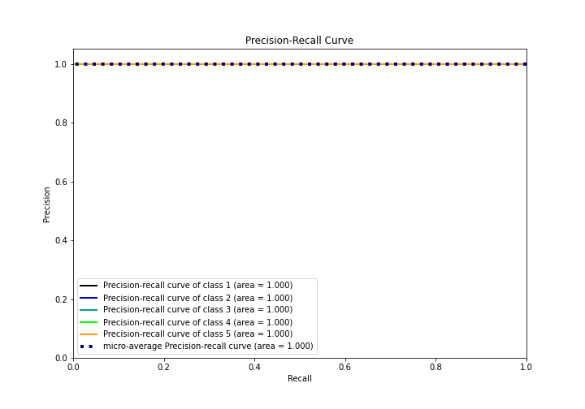

# Summary of Ensemble

[<< Go back](../README.md)

## Ensemble structure
| Model          |   Weight |
|:---------------|---------:|
| 2_DecisionTree |        1 |

### Metric details
|           |   1 |   2 |   3 |   4 |   5 |   accuracy |   macro avg |   weighted avg |   logloss |
|:----------|----:|----:|----:|----:|----:|-----------:|------------:|---------------:|----------:|
| precision |   1 |   1 |   1 |   1 |   1 |          1 |           1 |              1 |     4e-06 |
| recall    |   1 |   1 |   1 |   1 |   1 |          1 |           1 |              1 |     4e-06 |
| f1-score  |   1 |   1 |   1 |   1 |   1 |          1 |           1 |              1 |     4e-06 |
| support   |   5 |   5 |  14 |   9 |   5 |          1 |          38 |             38 |     4e-06 |

## Confusion matrix
|              |   Predicted as 1 |   Predicted as 2 |   Predicted as 3 |   Predicted as 4 |   Predicted as 5 |
|:-------------|-----------------:|-----------------:|-----------------:|-----------------:|-----------------:|
| Labeled as 1 |                5 |                0 |                0 |                0 |                0 |
| Labeled as 2 |                0 |                5 |                0 |                0 |                0 |
| Labeled as 3 |                0 |                0 |               14 |                0 |                0 |
| Labeled as 4 |                0 |                0 |                0 |                9 |                0 |
| Labeled as 5 |                0 |                0 |                0 |                0 |                5 |

## Learning curves

## Confusion Matrix

## Normalized Confusion Matrix

## ROC Curve

## Precision Recall Curve

[<< Go back](../README.md)
