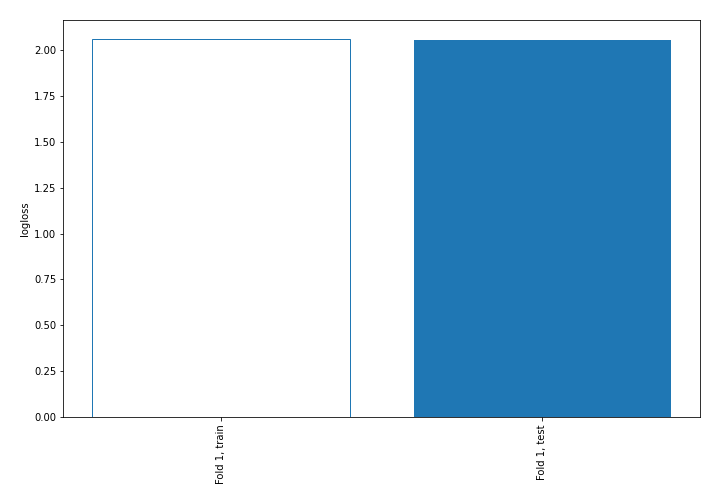
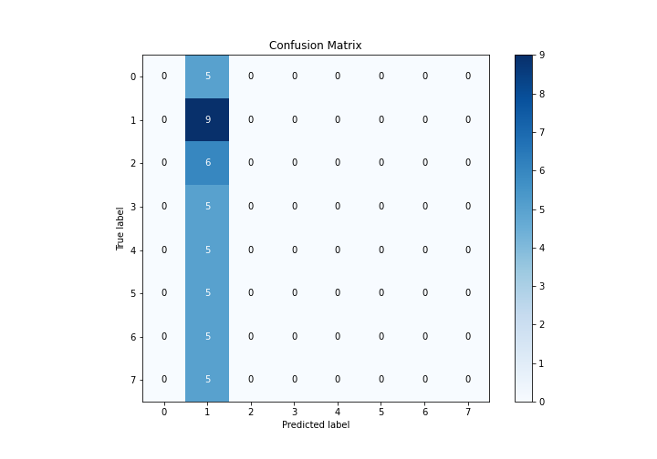
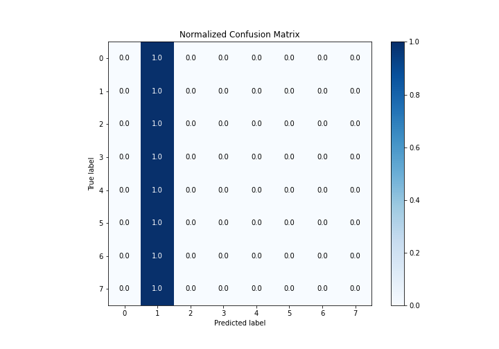
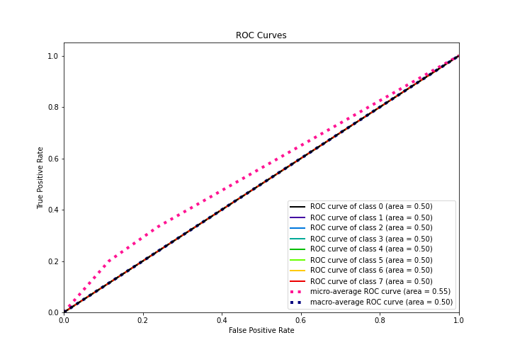
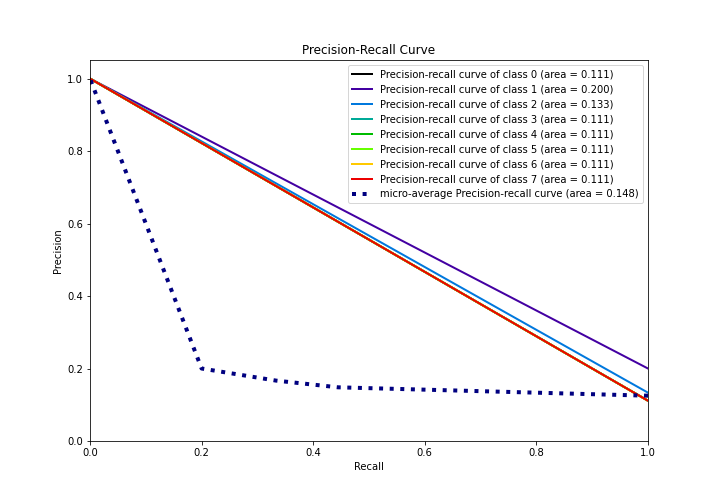

# Summary of 1_Baseline

[<< Go back](../README.md)

## Baseline Classifier (Baseline)
- **n_jobs**: -1
- **num_class**: 8
- **explain_level**: 2

## Validation
 - **validation_type**: split
 - **train_ratio**: 0.75
 - **shuffle**: True
 - **stratify**: True

## Optimized metric
logloss

## Training time

1.9 seconds

### Metric details
|           |   0 |        1 |   2 |   3 |   4 |   5 |   6 |   7 |   accuracy |   macro avg |   weighted avg |   logloss |
|:----------|----:|---------:|----:|----:|----:|----:|----:|----:|-----------:|------------:|---------------:|----------:|
| precision |   0 | 0.2      |   0 |   0 |   0 |   0 |   0 |   0 |        0.2 |   0.025     |      0.04      |   2.05573 |
| recall    |   0 | 1        |   0 |   0 |   0 |   0 |   0 |   0 |        0.2 |   0.125     |      0.2       |   2.05573 |
| f1-score  |   0 | 0.333333 |   0 |   0 |   0 |   0 |   0 |   0 |        0.2 |   0.0416667 |      0.0666667 |   2.05573 |
| support   |   5 | 9        |   6 |   5 |   5 |   5 |   5 |   5 |        0.2 |  45         |     45         |   2.05573 |

## Confusion matrix
|              |   Predicted as 0 |   Predicted as 1 |   Predicted as 2 |   Predicted as 3 |   Predicted as 4 |   Predicted as 5 |   Predicted as 6 |   Predicted as 7 |
|:-------------|-----------------:|-----------------:|-----------------:|-----------------:|-----------------:|-----------------:|-----------------:|-----------------:|
| Labeled as 0 |                0 |                5 |                0 |                0 |                0 |                0 |                0 |                0 |
| Labeled as 1 |                0 |                9 |                0 |                0 |                0 |                0 |                0 |                0 |
| Labeled as 2 |                0 |                6 |                0 |                0 |                0 |                0 |                0 |                0 |
| Labeled as 3 |                0 |                5 |                0 |                0 |                0 |                0 |                0 |                0 |
| Labeled as 4 |                0 |                5 |                0 |                0 |                0 |                0 |                0 |                0 |
| Labeled as 5 |                0 |                5 |                0 |                0 |                0 |                0 |                0 |                0 |
| Labeled as 6 |                0 |                5 |                0 |                0 |                0 |                0 |                0 |                0 |
| Labeled as 7 |                0 |                5 |                0 |                0 |                0 |                0 |                0 |                0 |

## Learning curves

## Confusion Matrix

## Normalized Confusion Matrix

## ROC Curve

## Precision Recall Curve

[<< Go back](../README.md)
