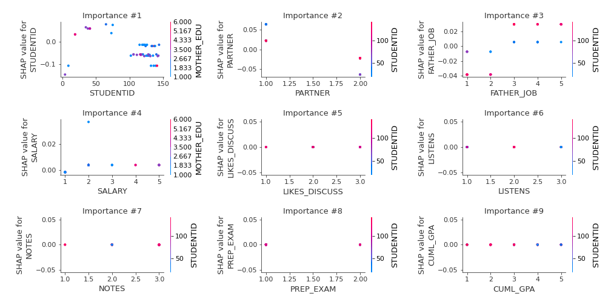

# Summary of 2_DecisionTree

[<< Go back](../README.md)

## Decision Tree
- **n_jobs**: -1
- **criterion**: gini
- **max_depth**: 3
- **num_class**: 8
- **explain_level**: 2

## Validation
 - **validation_type**: split
 - **train_ratio**: 0.75
 - **shuffle**: True
 - **stratify**: True

## Optimized metric
logloss

## Training time

25.1 seconds

### Metric details
|           |   0 |   1 |   2 |   3 |   4 |   5 |   6 |        7 |   accuracy |   macro avg |   weighted avg |   logloss |
|:----------|----:|----:|----:|----:|----:|----:|----:|---------:|-----------:|------------:|---------------:|----------:|
| precision |   0 |   0 |   0 |   0 |   0 |   0 |   0 | 0.111111 |  0.0444444 |   0.0138889 |      0.0123457 |   7.02917 |
| recall    |   0 |   0 |   0 |   0 |   0 |   0 |   0 | 0.4      |  0.0444444 |   0.05      |      0.0444444 |   7.02917 |
| f1-score  |   0 |   0 |   0 |   0 |   0 |   0 |   0 | 0.173913 |  0.0444444 |   0.0217391 |      0.0193237 |   7.02917 |
| support   |   5 |   9 |   6 |   5 |   5 |   5 |   5 | 5        |  0.0444444 |  45         |     45         |   7.02917 |

## Confusion matrix
|              |   Predicted as 0 |   Predicted as 1 |   Predicted as 2 |   Predicted as 3 |   Predicted as 4 |   Predicted as 5 |   Predicted as 6 |   Predicted as 7 |
|:-------------|-----------------:|-----------------:|-----------------:|-----------------:|-----------------:|-----------------:|-----------------:|-----------------:|
| Labeled as 0 |                0 |                2 |                2 |                0 |                1 |                0 |                0 |                0 |
| Labeled as 1 |                0 |                0 |                0 |                0 |                5 |                0 |                0 |                4 |
| Labeled as 2 |                0 |                0 |                0 |                0 |                5 |                0 |                0 |                1 |
| Labeled as 3 |                0 |                0 |                0 |                0 |                0 |                0 |                0 |                5 |
| Labeled as 4 |                0 |                3 |                1 |                0 |                0 |                0 |                0 |                1 |
| Labeled as 5 |                0 |                0 |                1 |                0 |                2 |                0 |                0 |                2 |
| Labeled as 6 |                1 |                0 |                0 |                0 |                1 |                0 |                0 |                3 |
| Labeled as 7 |                0 |                0 |                0 |                0 |                3 |                0 |                0 |                2 |

## Learning curves

## Decision Tree 

### Tree #1

### Rules

if (STUDENTID <= 74.5) and (STUDENTID > 9.5) and (PARTNER > 1.5) then class: 2 (proba: 38.89%) | based on 36 samples

if (STUDENTID <= 74.5) and (STUDENTID > 9.5) and (PARTNER <= 1.5) then class: 1 (proba: 33.33%) | based on 36 samples

if (STUDENTID > 74.5) and (STUDENTID > 87.5) and (FATHER_JOB > 2.5) then class: 4 (proba: 38.89%) | based on 18 samples

if (STUDENTID > 74.5) and (STUDENTID > 87.5) and (FATHER_JOB <= 2.5) then class: 7 (proba: 57.14%) | based on 14 samples

if (STUDENTID > 74.5) and (STUDENTID <= 87.5) and (SALARY <= 1.5) then class: 5 (proba: 80.0%) | based on 10 samples

if (STUDENTID <= 74.5) and (STUDENTID <= 9.5) and (GENDER > 1.5) then class: 7 (proba: 87.5%) | based on 8 samples

if (STUDENTID <= 74.5) and (STUDENTID <= 9.5) and (GENDER <= 1.5) then class: 0 (proba: 50.0%) | based on 8 samples

if (STUDENTID > 74.5) and (STUDENTID <= 87.5) and (SALARY > 1.5) then class: 2 (proba: 40.0%) | based on 5 samples

## Permutation-based Importance

## Confusion Matrix

## Normalized Confusion Matrix

## ROC Curve

## Precision Recall Curve

## SHAP Importance

## SHAP Dependence plots

### Dependence 0 (Fold 1)

### Dependence 1 (Fold 1)

### Dependence 2 (Fold 1)

### Dependence 3 (Fold 1)

### Dependence 4 (Fold 1)

### Dependence 5 (Fold 1)

### Dependence 6 (Fold 1)

### Dependence 7 (Fold 1)

## SHAP Decision plots

### Worst decisions for selected sample 1 (Fold 1)

### Worst decisions for selected sample 2 (Fold 1)

### Worst decisions for selected sample 3 (Fold 1)

### Worst decisions for selected sample 4 (Fold 1)

### Best decisions for selected sample 1 (Fold 1)

### Best decisions for selected sample 2 (Fold 1)

### Best decisions for selected sample 3 (Fold 1)

### Best decisions for selected sample 4 (Fold 1)

[<< Go back](../README.md)
