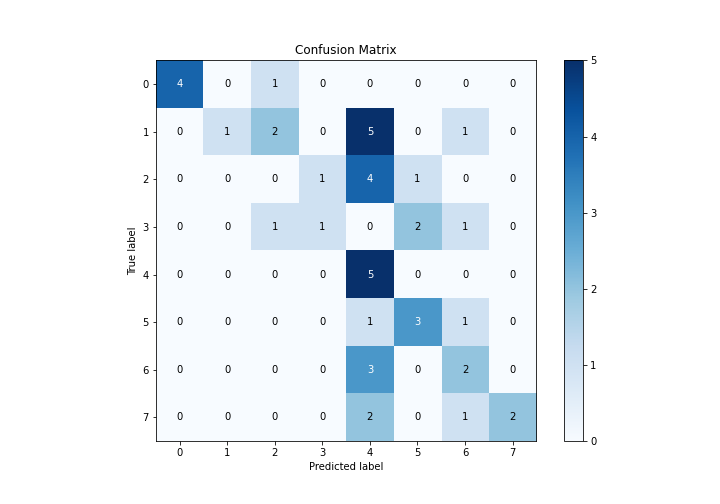

# Summary of 3_Linear

[<< Go back](../README.md)

## Logistic Regression (Linear)
- **n_jobs**: -1
- **num_class**: 8
- **explain_level**: 2

## Validation
 - **validation_type**: split
 - **train_ratio**: 0.75
 - **shuffle**: True
 - **stratify**: True

## Optimized metric
logloss

## Training time

15.8 seconds

### Metric details
|           |        0 |        1 |   2 |        3 |    4 |        5 |        6 |        7 |   accuracy |   macro avg |   weighted avg |   logloss |
|:----------|---------:|---------:|----:|---------:|-----:|---------:|---------:|---------:|-----------:|------------:|---------------:|----------:|
| precision | 1        | 1        |   0 | 0.5      | 0.25 | 0.5      | 0.333333 | 1        |        0.4 |    0.572917 |       0.598148 |   2.80413 |
| recall    | 0.8      | 0.111111 |   0 | 0.2      | 1    | 0.6      | 0.4      | 0.4      |        0.4 |    0.438889 |       0.4      |   2.80413 |
| f1-score  | 0.888889 | 0.2      |   0 | 0.285714 | 0.4  | 0.545455 | 0.363636 | 0.571429 |        0.4 |    0.40689  |       0.379458 |   2.80413 |
| support   | 5        | 9        |   6 | 5        | 5    | 5        | 5        | 5        |        0.4 |   45        |      45        |   2.80413 |

## Confusion matrix
|              |   Predicted as 0 |   Predicted as 1 |   Predicted as 2 |   Predicted as 3 |   Predicted as 4 |   Predicted as 5 |   Predicted as 6 |   Predicted as 7 |
|:-------------|-----------------:|-----------------:|-----------------:|-----------------:|-----------------:|-----------------:|-----------------:|-----------------:|
| Labeled as 0 |                4 |                0 |                1 |                0 |                0 |                0 |                0 |                0 |
| Labeled as 1 |                0 |                1 |                2 |                0 |                5 |                0 |                1 |                0 |
| Labeled as 2 |                0 |                0 |                0 |                1 |                4 |                1 |                0 |                0 |
| Labeled as 3 |                0 |                0 |                1 |                1 |                0 |                2 |                1 |                0 |
| Labeled as 4 |                0 |                0 |                0 |                0 |                5 |                0 |                0 |                0 |
| Labeled as 5 |                0 |                0 |                0 |                0 |                1 |                3 |                1 |                0 |
| Labeled as 6 |                0 |                0 |                0 |                0 |                3 |                0 |                2 |                0 |
| Labeled as 7 |                0 |                0 |                0 |                0 |                2 |                0 |                1 |                2 |

## Learning curves

## Coefficients

### Coefficients learner #1
|               |          0 |           1 |           2 |           3 |          4 |          5 |           6 |          7 |
|:--------------|-----------:|------------:|------------:|------------:|-----------:|-----------:|------------:|-----------:|
| intercept     | -1.39388   |  1.73114    |  0.506197   |  0.153146   |  0.100163  | -0.281434  |  0.0385996  | -0.853927  |
| STUDENTID     | -1.008     | -0.703841   | -0.576327   | -0.477876   |  1.12866   |  1.36647   |  0.828255   | -0.557334  |
| AGE           | -0.371017  |  0.641589   |  0.19443    |  0.567653   | -0.371999  |  0.374551  | -0.0487999  | -0.986407  |
| GENDER        | -1.33092   | -0.106411   |  0.192949   | -0.272061   | -0.234198  | -0.428529  |  0.591353   |  1.58782   |
| HS_TYPE       | -0.369423  |  0.223793   |  0.111948   | -0.478621   | -0.528692  |  0.0941249 |  0.195016   |  0.751854  |
| SCHOLARSHIP   | -0.32765   |  0.513163   |  0.314177   | -0.606248   | -0.372437  |  0.309768  |  0.192738   | -0.0235118 |
| WORK          |  0.0443235 | -0.254999   | -0.332436   | -0.274234   | -1.03072   |  0.668561  |  0.622325   |  0.557175  |
| ACTIVITY      | -0.058176  | -0.0183316  | -0.163904   |  1.15       | -0.587842  | -0.384828  | -0.264073   |  0.327158  |
| PARTNER       | -0.885389  |  0.0343999  |  1.29895    | -0.524792   | -0.137497  | -0.35788   |  0.278401   |  0.293804  |
| SALARY        |  0.424804  | -0.00289076 |  0.0635743  |  0.295713   |  0.309141  | -0.594782  | -0.763054   |  0.267494  |
| TRANSPORT     |  0.979139  |  0.356042   | -0.198099   | -0.0101227  | -0.253968  |  0.203104  | -0.522273   | -0.553823  |
| LIVING        |  0.136181  | -0.391756   | -0.0397337  | -0.00800259 | -0.856374  |  0.160385  |  0.849858   |  0.149442  |
| MOTHER_EDU    | -0.185124  |  0.257722   |  0.329284   | -0.725598   |  0.233806  | -0.262943  |  0.338406   |  0.014447  |
| FATHER_EDU    |  0.321277  |  0.242976   | -0.592236   |  0.327589   | -0.353369  | -0.0112746 | -0.572894   |  0.637932  |
| #_SIBLINGS    |  0.433621  |  0.0597382  | -1.07512    |  0.183132   | -0.0112075 |  0.539391  |  0.200668   | -0.330219  |
| KIDS          |  0.333439  | -0.668519   |  0.405059   | -0.343735   | -0.584913  |  0.262002  | -0.0636369  |  0.660304  |
| MOTHER_JOB    |  0.447296  | -0.440123   | -0.0625127  |  0.754162   |  0.222982  | -0.379387  | -0.508108   | -0.0343083 |
| FATHER_JOB    | -0.0313009 |  0.194407   |  0.00193913 |  0.414445   | -0.619556  |  0.0673695 |  0.716868   | -0.744172  |
| STUDY_HRS     | -0.0212173 | -0.128914   | -0.442671   |  0.735249   |  0.292306  | -0.157808  | -0.215086   | -0.0618582 |
| READ_FREQ     |  0.156082  | -0.141015   | -0.66132    | -0.525773   | -0.0387386 | -0.317747  |  0.16582    |  1.36269   |
| READ_FREQ_SCI |  0.272789  | -0.583188   | -0.00373658 |  0.585848   | -0.208909  |  0.669762  | -0.00638575 | -0.72618   |
| ATTEND_DEPT   |  0.692602  |  0.0296079  | -0.324169   | -0.156695   |  0.0350442 |  0.0299578 | -0.333834   |  0.0274851 |
| IMPACT        |  0.136096  | -0.115533   |  0.71144    |  0.32824    |  0.241842  | -0.542135  | -0.404387   | -0.355563  |
| ATTEND        |  0.104396  |  0.189752   | -0.0988823  | -0.660452   |  0.523454  |  0.310416  |  0.17183    | -0.540513  |
| PREP_STUDY    |  0.207056  | -0.0219448  | -0.0230728  |  0.178665   | -0.241055  |  0.128904  | -0.416607   |  0.188054  |
| PREP_EXAM     | -0.190491  |  0.157574   |  0.144561   | -0.0890285  | -0.068846  | -0.433839  |  0.256097   |  0.22397   |
| NOTES         | -0.497763  |  0.683808   | -0.07469    | -0.0955776  |  0.124605  |  0.327817  | -0.529187   |  0.0609868 |
| LISTENS       | -0.354801  |  0.0608543  | -0.231499   |  0.1876     |  0.139163  |  0.111537  | -0.0402591  |  0.127404  |
| LIKES_DISCUSS | -0.0585298 | -0.416849   | -0.108927   |  0.495583   |  0.227761  | -0.188257  | -0.654527   |  0.703745  |
| CLASSROOM     |  0.556064  | -0.15675    | -0.506561   |  0.340012   |  0.119746  | -0.415952  |  0.412695   | -0.349253  |
| CUML_GPA      | -0.503702  | -0.860902   | -0.96946    |  0.030416   |  0.674193  |  1.08424   |  0.80864    | -0.263422  |
| EXP_GPA       | -0.246761  |  0.122702   |  0.00953066 |  0.995763   | -0.478225  |  0.0855919 | -0.560582   |  0.0719805 |
| COURSE ID     | -0.485709  | -0.85564    | -0.747735   |  0.187174   |  0.327883  | -0.732382  |  1.39552    |  0.910888  |

## Permutation-based Importance

## Confusion Matrix

## Normalized Confusion Matrix

## ROC Curve

## Precision Recall Curve

## SHAP Importance

## SHAP Dependence plots

### Dependence 0 (Fold 1)

### Dependence 1 (Fold 1)

### Dependence 2 (Fold 1)

### Dependence 3 (Fold 1)

### Dependence 4 (Fold 1)

### Dependence 5 (Fold 1)

### Dependence 6 (Fold 1)

### Dependence 7 (Fold 1)

## SHAP Decision plots

### Worst decisions for selected sample 1 (Fold 1)

### Worst decisions for selected sample 2 (Fold 1)

### Worst decisions for selected sample 3 (Fold 1)

### Worst decisions for selected sample 4 (Fold 1)

### Best decisions for selected sample 1 (Fold 1)

### Best decisions for selected sample 2 (Fold 1)

### Best decisions for selected sample 3 (Fold 1)

### Best decisions for selected sample 4 (Fold 1)

[<< Go back](../README.md)
