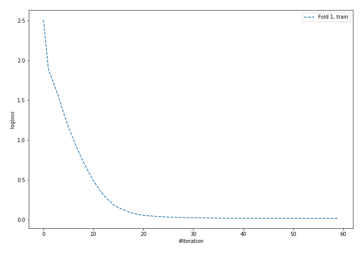
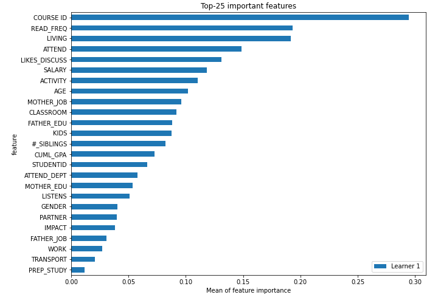
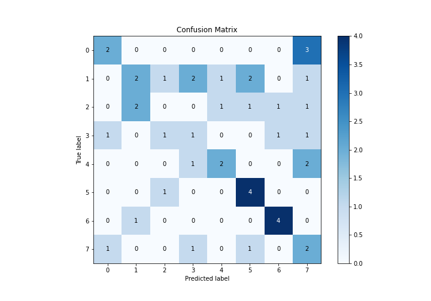
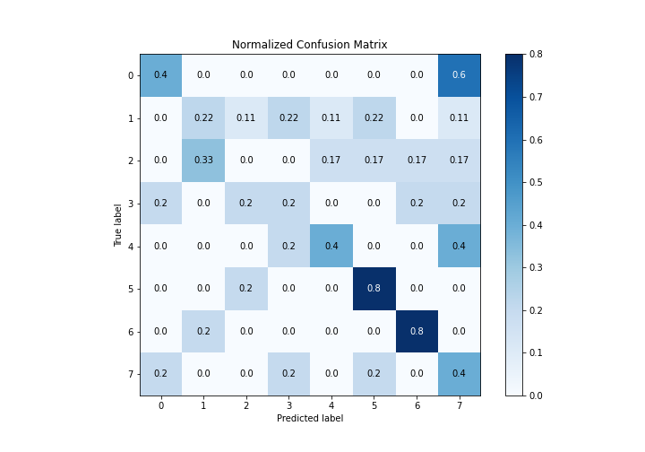
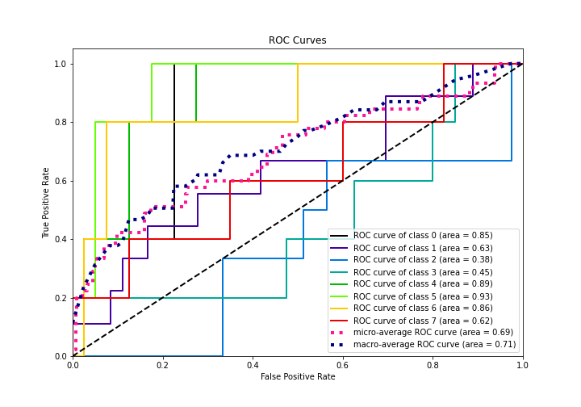
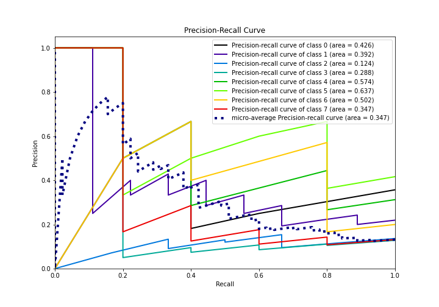

# Summary of 5_Default_NeuralNetwork

[<< Go back](../README.md)

## Neural Network
- **n_jobs**: -1
- **dense_1_size**: 32
- **dense_2_size**: 16
- **learning_rate**: 0.05
- **num_class**: 8
- **explain_level**: 2

## Validation
 - **validation_type**: split
 - **train_ratio**: 0.75
 - **shuffle**: True
 - **stratify**: True

## Optimized metric
logloss

## Training time

1.9 seconds

### Metric details
|           |        0 |        1 |   2 |   3 |        4 |        5 |        6 |        7 |   accuracy |   macro avg |   weighted avg |   logloss |
|:----------|---------:|---------:|----:|----:|---------:|---------:|---------:|---------:|-----------:|------------:|---------------:|----------:|
| precision | 0.5      | 0.4      |   0 | 0.2 | 0.5      | 0.5      | 0.666667 | 0.2      |   0.377778 |    0.370833 |       0.365185 |   2.38751 |
| recall    | 0.4      | 0.222222 |   0 | 0.2 | 0.4      | 0.8      | 0.8      | 0.4      |   0.377778 |    0.402778 |       0.377778 |   2.38751 |
| f1-score  | 0.444444 | 0.285714 |   0 | 0.2 | 0.444444 | 0.615385 | 0.727273 | 0.266667 |   0.377778 |    0.372991 |       0.356944 |   2.38751 |
| support   | 5        | 9        |   6 | 5   | 5        | 5        | 5        | 5        |   0.377778 |   45        |      45        |   2.38751 |

## Confusion matrix
|              |   Predicted as 0 |   Predicted as 1 |   Predicted as 2 |   Predicted as 3 |   Predicted as 4 |   Predicted as 5 |   Predicted as 6 |   Predicted as 7 |
|:-------------|-----------------:|-----------------:|-----------------:|-----------------:|-----------------:|-----------------:|-----------------:|-----------------:|
| Labeled as 0 |                2 |                0 |                0 |                0 |                0 |                0 |                0 |                3 |
| Labeled as 1 |                0 |                2 |                1 |                2 |                1 |                2 |                0 |                1 |
| Labeled as 2 |                0 |                2 |                0 |                0 |                1 |                1 |                1 |                1 |
| Labeled as 3 |                1 |                0 |                1 |                1 |                0 |                0 |                1 |                1 |
| Labeled as 4 |                0 |                0 |                0 |                1 |                2 |                0 |                0 |                2 |
| Labeled as 5 |                0 |                0 |                1 |                0 |                0 |                4 |                0 |                0 |
| Labeled as 6 |                0 |                1 |                0 |                0 |                0 |                0 |                4 |                0 |
| Labeled as 7 |                1 |                0 |                0 |                1 |                0 |                1 |                0 |                2 |

## Learning curves

## Permutation-based Importance

## Confusion Matrix

## Normalized Confusion Matrix

## ROC Curve

## Precision Recall Curve

[<< Go back](../README.md)
