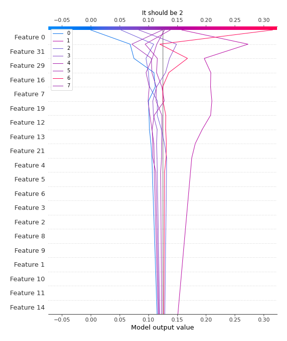

# Summary of 6_Default_RandomForest

[<< Go back](../README.md)

## Random Forest
- **n_jobs**: -1
- **criterion**: gini
- **max_features**: 0.9
- **min_samples_split**: 30
- **max_depth**: 4
- **eval_metric_name**: logloss
- **num_class**: 8
- **explain_level**: 2

## Validation
 - **validation_type**: split
 - **train_ratio**: 0.75
 - **shuffle**: True
 - **stratify**: True

## Optimized metric
logloss

## Training time

26.5 seconds

### Metric details
|           |        0 |        1 |   2 |   3 |   4 |   5 |        6 |        7 |   accuracy |   macro avg |   weighted avg |   logloss |
|:----------|---------:|---------:|----:|----:|----:|----:|---------:|---------:|-----------:|------------:|---------------:|----------:|
| precision | 1        | 0.363636 |   0 |   0 |   0 |   0 | 0.16     | 0.25     |   0.244444 |    0.221705 |       0.229394 |    1.8498 |
| recall    | 0.4      | 0.444444 |   0 |   0 |   0 |   0 | 0.8      | 0.2      |   0.244444 |    0.230556 |       0.244444 |    1.8498 |
| f1-score  | 0.571429 | 0.4      |   0 |   0 |   0 |   0 | 0.266667 | 0.222222 |   0.244444 |    0.18254  |       0.197813 |    1.8498 |
| support   | 5        | 9        |   6 |   5 |   5 |   5 | 5        | 5        |   0.244444 |   45        |      45        |    1.8498 |

## Confusion matrix
|              |   Predicted as 0 |   Predicted as 1 |   Predicted as 2 |   Predicted as 3 |   Predicted as 4 |   Predicted as 5 |   Predicted as 6 |   Predicted as 7 |
|:-------------|-----------------:|-----------------:|-----------------:|-----------------:|-----------------:|-----------------:|-----------------:|-----------------:|
| Labeled as 0 |                2 |                1 |                2 |                0 |                0 |                0 |                0 |                0 |
| Labeled as 1 |                0 |                4 |                0 |                0 |                0 |                0 |                5 |                0 |
| Labeled as 2 |                0 |                1 |                0 |                0 |                0 |                0 |                5 |                0 |
| Labeled as 3 |                0 |                0 |                0 |                0 |                0 |                0 |                4 |                1 |
| Labeled as 4 |                0 |                4 |                0 |                0 |                0 |                0 |                0 |                1 |
| Labeled as 5 |                0 |                1 |                0 |                0 |                0 |                0 |                4 |                0 |
| Labeled as 6 |                0 |                0 |                0 |                0 |                0 |                0 |                4 |                1 |
| Labeled as 7 |                0 |                0 |                0 |                0 |                1 |                0 |                3 |                1 |

## Learning curves

## Permutation-based Importance

## Confusion Matrix

## Normalized Confusion Matrix

## ROC Curve

## Precision Recall Curve

## SHAP Importance

## SHAP Dependence plots

### Dependence 0 (Fold 1)

### Dependence 1 (Fold 1)

### Dependence 2 (Fold 1)

### Dependence 3 (Fold 1)

### Dependence 4 (Fold 1)

### Dependence 5 (Fold 1)

### Dependence 6 (Fold 1)

### Dependence 7 (Fold 1)

## SHAP Decision plots

### Worst decisions for selected sample 1 (Fold 1)

### Worst decisions for selected sample 2 (Fold 1)

### Worst decisions for selected sample 3 (Fold 1)

### Worst decisions for selected sample 4 (Fold 1)

### Best decisions for selected sample 1 (Fold 1)

### Best decisions for selected sample 2 (Fold 1)

### Best decisions for selected sample 3 (Fold 1)

### Best decisions for selected sample 4 (Fold 1)

[<< Go back](../README.md)
