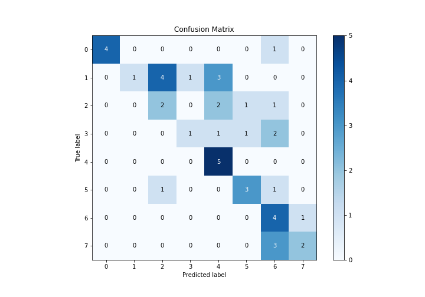

# Summary of Ensemble

[<< Go back](../README.md)

## Ensemble structure
| Model                   |   Weight |
|:------------------------|---------:|
| 4_Default_Xgboost       |        3 |
| 5_Default_NeuralNetwork |        1 |
| 6_Default_RandomForest  |        1 |

### Metric details
|           |        0 |        1 |        2 |        3 |        4 |   5 |        6 |        7 |   accuracy |   macro avg |   weighted avg |   logloss |
|:----------|---------:|---------:|---------:|---------:|---------:|----:|---------:|---------:|-----------:|------------:|---------------:|----------:|
| precision | 1        | 1        | 0.285714 | 0.5      | 0.454545 | 0.6 | 0.333333 | 0.666667 |   0.488889 |    0.605032 |       0.633045 |   1.58303 |
| recall    | 0.8      | 0.111111 | 0.333333 | 0.2      | 1        | 0.6 | 0.8      | 0.4      |   0.488889 |    0.530556 |       0.488889 |   1.58303 |
| f1-score  | 0.888889 | 0.2      | 0.307692 | 0.285714 | 0.625    | 0.6 | 0.470588 | 0.5      |   0.488889 |    0.484735 |       0.455491 |   1.58303 |
| support   | 5        | 9        | 6        | 5        | 5        | 5   | 5        | 5        |   0.488889 |   45        |      45        |   1.58303 |

## Confusion matrix
|              |   Predicted as 0 |   Predicted as 1 |   Predicted as 2 |   Predicted as 3 |   Predicted as 4 |   Predicted as 5 |   Predicted as 6 |   Predicted as 7 |
|:-------------|-----------------:|-----------------:|-----------------:|-----------------:|-----------------:|-----------------:|-----------------:|-----------------:|
| Labeled as 0 |                4 |                0 |                0 |                0 |                0 |                0 |                1 |                0 |
| Labeled as 1 |                0 |                1 |                4 |                1 |                3 |                0 |                0 |                0 |
| Labeled as 2 |                0 |                0 |                2 |                0 |                2 |                1 |                1 |                0 |
| Labeled as 3 |                0 |                0 |                0 |                1 |                1 |                1 |                2 |                0 |
| Labeled as 4 |                0 |                0 |                0 |                0 |                5 |                0 |                0 |                0 |
| Labeled as 5 |                0 |                0 |                1 |                0 |                0 |                3 |                1 |                0 |
| Labeled as 6 |                0 |                0 |                0 |                0 |                0 |                0 |                4 |                1 |
| Labeled as 7 |                0 |                0 |                0 |                0 |                0 |                0 |                3 |                2 |

## Learning curves

## Confusion Matrix

## Normalized Confusion Matrix

## ROC Curve

## Precision Recall Curve

[<< Go back](../README.md)
